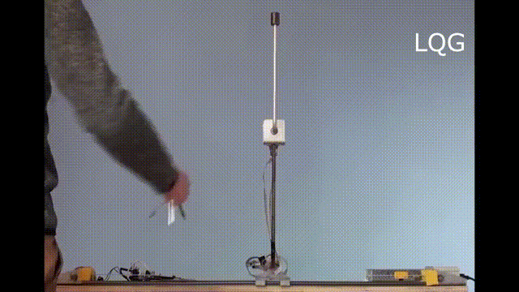

# Fuzzy Inverted Pendulum

This project consists of controlling an inverted pendulum using a fuzzy controller. The inverted pendulum and its
environment are modeled using the pygame library in Python 2.7. The controller logic is developed from scratch.

### The Problem

The inverted pendulum is a pendulum that is attached to a cart and balanced in an inverted upright position. It is
inherently unstable and requires active control to keep it balanced. The goal is to apply forces to the cart to keep the
pendulum upright despite its nonlinearity and instability. The inverted pendulum is a classic benchmark problem in
control theory and robotics.

[//]: # (![figs/inverted-pendulum.mp4]&#40;figs/inverted-pendulum.mp4&#41;)

[//]: # ( </img>)

[//]: # (<video width="320" height="240" controls>)

[//]: # (<source src="figs/inverted-pendulum.mp4" type="video/mp4">)

[//]: # (</video>)

### The Solution

Fuzzy logic controllers can balance the inverted pendulum by converting sensor measurements to linguistic values like "
small" or "big" angle. Intuitive fuzzy rules like "IF angle is big, THEN apply large force" are defined. These map the
linguistic values to appropriate control outputs to keep the pendulum balanced. The fuzzy logic approach handles the
instability and nonlinearity well without requiring precise analytical models.

## Getting Started

As far as I know, the pyfuzzy library is only available for Python 2.7. This makes the installation of pygame on this
environment on MacOS difficult (since pygame's library requirements are not compatible with the new macOS version by
default). However, the installation (at least for me) went smoothly.

### Install

    $ sudo pip install virtualenv
    $ virtualenv -p python2.7 venv
    $ source venv/bin/activate
    $ ./install-deps.sh

### Run

    $ ./main.py

Also, you can run the project using custom configurations located in the **configs** directory.

	$ ./main.py configs/full.ini

## Usage

### Physical parameters of simulator

> **M**: cart mass, *kg*
>
> **m**: pendulum mass, *kg*
>
> **l**: pendulum length, *m*
>
> **x**: cart position, *m*
>
> **v**: cart velocity, *m/s*
>
> **a**: cart acceleration, *m/s^2*
>
> **theta**: pendulum central angle, *radian*
>
> **omega**: pendulum angular velocity, *m/s*
>
> **alpha**: pendulum angular acceleration, *m/s^2*
>
> **g**: gravity acceleration, *m/s^2*
>
> **b**: cart coefficient of friction, *newton/m/s*
>
> **I**: moment of inertia, *kg.m^2*
>
> **min_x**: cart minimum x, *m*
>
> **max_x**: cart maximum x, *m*
>
> **force**: force applied on cart, *newton*

You can see all the parameters in **world.py** module.
These parameters can be modified using the configuration files located in the [configs](src/configs) directory.

### Fuzzy Control Language (FCL)

The `FuzzyController` class in the [controller.py](src/controller.py) module loads an FCL file to decide how much force
needs to be applied to the cart in each cycle of the simulation. FCL files can be found in
the [controllers](src/controllers) directory. You
can create your own controller by writing a new FCL file and specifying it in the config files by changing
the `fcl_path` value.

**configs/default.ini**:

	[simulator]
	dt = 0.1
	fps = 60

	[controller]
	fcl_path = controllers/simple.fcl

	[world]
	theta = -90.0

### Fuzzy Controller

The implemented fuzzy controller consists of four main methods:

- Reading the Problem: The `read_fuzzy_problem` method reads the fuzzy logic problem definition from an input YAML
  file ([input.yml](src/input.yml) by default). This file includes the fuzzy variables and rules.

- Modeling the Problem: The fuzzy variables are modeled as `FuzzyVar` objects which contain the variable name and
  associated fuzzy sets. The fuzzy rules are modeled as `FuzzyRule` objects containing the IF-THEN rule hypotheses and
  conclusions.

- Inference: The `inference` method evaluates each fuzzy rule against the current inputs and returns a dictionary
  mapping
  each output force fuzzy set to its membership value. This is done by checking the rule hypotheses against the input
  fuzzy variable values.

- "Defuzzifying": This method transforms the fuzzy output dictionary into a single crisp force value for the inverted
  pendulum control. It creates membership value shapes for each output force fuzzy set. These shapes are combined using
  shapely's `cascade_union` operation. Taking the centroid of this aggregated shape gives the final defuzzified force
  value.

### Demo

## Contributors

To the best of my knowledge, this project was designed by [Hassan Kazemi Tehrani](https://github.com/shayanthrn) and
Kasra Mojallal, who also provided the starter code. My contributions include solving the problem using the added
FuzzyController ands its related classes.

## Course Information

- **Course**: Computational Intelligence
- **University**: Amirkabir University of Technology
- **Semester**: Fall 2021

Let me know if you have any questions!
